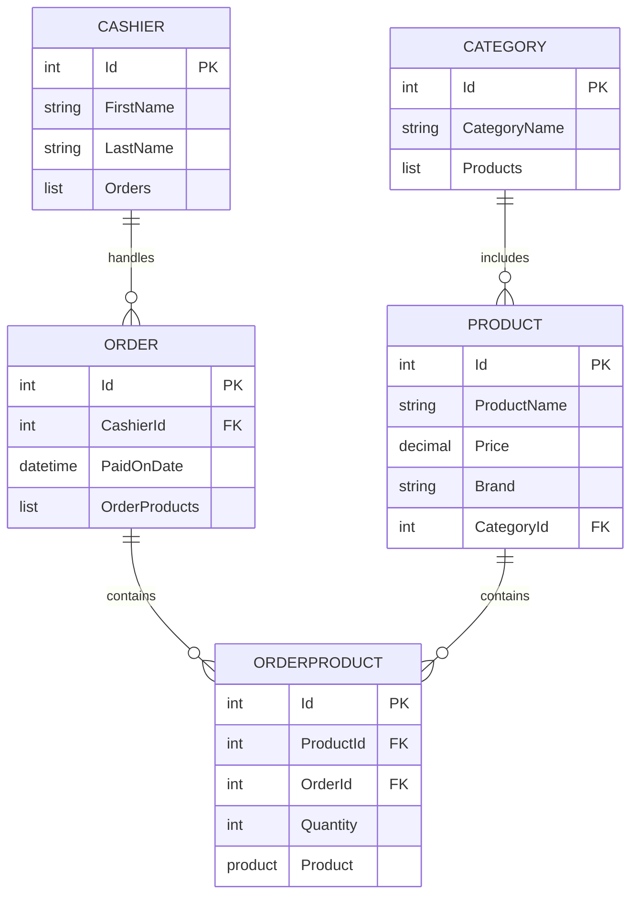

```mermaid
erDiagram
    CASHIER ||--o{ ORDER : handles
    CATEGORY ||--o{ PRODUCT : includes
    ORDER ||--o{ ORDERPRODUCT : contains
    PRODUCT ||--o{ ORDERPRODUCT : contains


    CASHIER {
        int Id PK
        string FirstName
        string LastName
        list Orders
    }
    CATEGORY {
        int Id PK
        string CategoryName
        list Products
    }
    ORDER {
        int Id PK
        int CashierId FK
        datetime PaidOnDate
        list OrderProducts
    }
    ORDERPRODUCT {
        int Id PK
        int ProductId FK
        int OrderId FK
        int Quantity
        product Product
    }
    PRODUCT {
        int Id PK
        string ProductName
        decimal Price
        string Brand
        int CategoryId FK
    }

```
